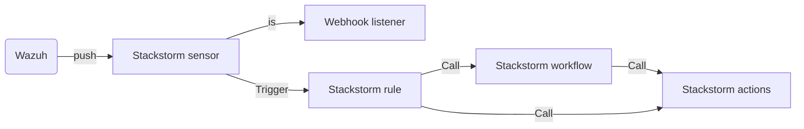
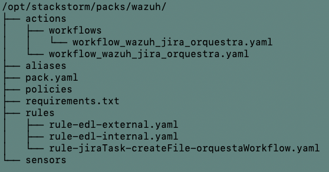
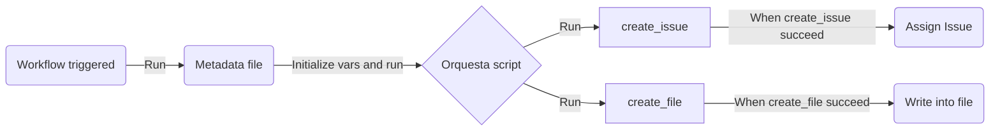

# Event-driven automation project
For this use case we will use the following tools:
   - Stackstom
   - Wazuh
   - Python
   - Jira

This is an introduction to the event-driven automation project.  
The goal is to see how to use stackstorm in order to automate a workflow. 
In this case we will use a Wazuh alert to create a Jira issue.  
For testing the workflow automation, I used the wazuh-test instance. And I integrated the server "learning-2023-02", so I can receive alerts from the learning-2023-02 in wazuh and instead of using sample data.


## Use case description

### Graphical representation of the workflow
   


### Push sensor / Stackstorm integration in wazuh

When wazuh receive an alert from the learning-2023-02, it will run a python script.  
This script is declared in the /etc/ossec/etc/ossec.conf file.  
The python file is located in the /var/ossec/integrations folder.  
The python script will send a POST request to the stackstorm API, with the alert information.  
On the stackstorm server, the POST request will be received by the webhook sensor (named core.st2.webhook), which will trigger the workflow.  

### Stackstorm wazuh pack

I created a wazuh pack in stackstorm, which contains the webhook sensor and the workflow.  
The pack is located in the /opt/stackstorm/packs/wazuh folder.  
Here you can see the arborecence of the pack:



### Stackstorm rule

In the wazuh pack, there is a rule that will be triggered by the webhook sensor.
The rule will run a workflow as we will see in the next section.
This rule is located in the /opt/stackstorm/packs/wazuh/rules folder.
I used two differents ways to filter the alerts.  
By filtering directly on the wazuh instance : explained in the following sections.  
Or by filtering directly in the stackstorm rule with a criteria.  
For the rule rule-jiraTask-createFile-orquestaWorkflow.yaml I used a criteria to filter the alerts.  
For the rules rule-edl-external.yaml and rule-edl-internal.yaml I used the wazuh instance to filter the alerts.  
There is three differents rules configured :
 - /stackstorm/rule-jiraTask-createFile-orquestaWorkflow.yaml will trigger the orquesta workflow that we will see in the Stackstorm workflow section.
 - /stackstorm/rule-edl-external.yaml  will trigger the gitlab action and update the file for external IPs in a gitlab repo.
 - /stackstorm/rule-edl-internal.yaml  will trigger the gitlab action and update the file for internal IPs in a gitlab repo.

### Stackstorm action

I created a python script based action in the GitLab pack that update a file in a GitLab repository. For testing, right now the file that is being modified is EDL.txt in this repository.
This could be used to update an External Dynamic List to block IPs in a Palo Alto firewall for example.
Script is located in the /stackstorm/modify_file.py file.
The metadata file for this script is located in the /stackstorm/modify_file.yaml file. It is used te collect the variables needed for the script to run : Here, I collect the srcip from the alert that is going to be added to EDL.txt file.


### Stackstorm workflow

On the following chart, the graphical representation of the workflow is shown :



### Integration config in wazuh on the production environment
 
We will use the CDB lists already configured.  
First list is the list of the internal networks. It is located in the /var/ossec/lists/ess-client-nets file. We will filter source ip that are in this list.  
Second list is the list of the external networks. It is located in the /var/ossec/lists/gpn-client-nets file. We will filter source ip that are not in this list.  
And we are going to specify this list in the ruleset of ossec.conf file.

```xml
<ruleset>
    <list>etc/lists/ess-client-nets</list>
    <list>etc/lists/gpn-client-nets</list>
</ruleset>
```

```xml
<rule id="66034" level="10">
    <if_sid>66020</if_sid>
    <match>SSH::Password_Guessing|SNIFFPASS::HTTP_POST_Password_Seen</match> <!-- Match for the alerts concerning Password_Guessing or HTTP_POST_Password_Seen -->
    <description>Zeek: Alert Notice details ssh password guessing detected.</description>
    <group>internal,</group> <!-- Ties a internal group to the rule triggered so that we can filter in the integration (see next section) -->
    <list field="srcip" lookup="address_match_key">etc/lists/gpn-client-nets</list>
  </rule>
```

```xml
<rule id="66045" level="7">
    <if_sid>66020</if_sid>
    <match>DNS_AXFR|DnsTunnelsAttack:DNS::External_Name</match> <!-- Match for the alerts concerning DNS_AXFR or DnsTunnelsAttack -->
    <description>Zeek: Alert Notice for DNS zone transfer or DNS tunnel attempt/attack detected.</description>
    <list field="srcip" lookup="not_address_match_key">etc/lists/ess-client-nets</list>
    <group>external,</group> <!-- Ties a external group to the rule triggered so that we can filter in the integration (see next section) -->
  </rule>
```

Update the ossec.conf file with your integration config : 

```xml
<!-- First integration sending data to first stackstorm rule-edl-external -->
    <integration>
          <name>custom-stackstorm-rule</name> <!-- Name of the python script we are sending the data (hook_url, api_key) into -->
          <hook_url>https://#stackstorm server hostname#/api/v1/webhooks/wazuh</hook_url> <!-- URL finishing by "wazuh" because the stackstorm rule for external action is listening to this specific URL -->
          <api_key>**API KEY**</api_key>
          <group>external</group> <!-- Filter alerts with external group created before in the rule -->
          <alert_format>json</alert_format>
        </integration>
```
```xml
<!-- Second integration sending data to second stackstorm rule-edl-internal -->
    <integration>
          <name>custom-stackstorm-rule</name> <!-- Name of the python script we are sending the data (hook_url, api_key) into -->
          <hook_url>https://#stackstorm server hostname#/api/v1/webhooks/wazuh2</hook_url> <!-- URL finishing by "wazuh2" because the stackstorm rule for internal action is listening to this specific URL -->
          <api_key>**API KEY**</api_key>
          <group>internal</group> <!-- Filter alerts with internal group created before in the rule -->
          <alert_format>json</alert_format>
        </integration>
```
You need to specify your personnal **API KEY**.   
In the intergation folder, we need to put the name of the script without the extension. Here it is custom-stackstorm-rule.

We are filtering alerts if the group is named internal or external. Those groups are explained before.  
After adding the custom integration script (python script) in the /var/ossec/integrations folder, we need to execute those commands :
```bash
chmod 750 custom-stackstorm-rule
chown root:ossec custom-stackstorm-rule
```

Once it is done, to apply the changes, we need to restart the wazuh service (only the update of ossec.conf file involve restart of wazuh-manager service) :

```bash
systemctl restart wazuh-manager
```

### Testing the workflow by creating an alert

To test the workflow, we need to create an alert in wazuh.  
Since we are filtering concerning DNS Transfer zone, we will create an alert for this.  
To do so, we need to be in an other network than the one of the wazuh server.  
For this, I connected to the 4g of my phone and I used the following command to create an alert : 

```bash
dig AXFR <domaine> @<public ip of domain> #command generating a DNS Zone transfer
```
### Troubleshooting

/var/log/st2/st2api.log : STACKSTORM API logs  
/var/osssec/logs/ossec.log : WAZUH logs
